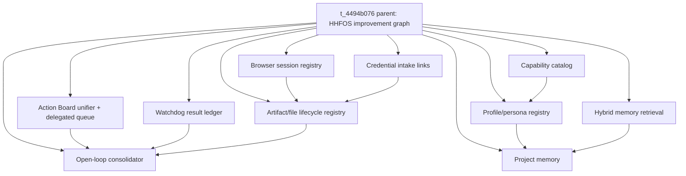

# HHFOS n8n-claw-inspired implementation graph

Created: 2026-06-18
Parent Kanban card: `t_4494b076`

## Objective

Port the useful operating patterns from the n8n-claw review into Hermes-native HHFOS building blocks instead of migrating orchestration to n8n. The target is not one monolith; it is a graph of small, testable primitives that plug into the existing Hermes surfaces: Kanban, Jarvis/Action Board, Hindsight/NAS search, cron/no-agent jobs, browser/computer-use lanes, profile skills, and local state files.

## Global constraints

- No external sends as part of implementation or verification.
- No real credential/OAuth/security changes.
- No destructive deletes or production restarts without a separate approval gate.
- Prefer reversible local state files, tests, and dry-runs.
- Keep model-facing core narrow: CLI/helpers/skills/scripts first; core tools only if a later card proves they are required.

## Dependency graph



## Slices

### 1. Action Board unifier + delegated queue semantics

Status: first implemented slice in this card.
Existing child: `t_d7350fc5`.

Purpose: unify Mohib-facing pending decisions, in-flight/delegated worker items, and blocked Kanban items so Jarvis BRIEFING does not repeatedly ask about work that has already been delegated.

Contract:
- Registry item delegated to worker records `delegated_task_id`, `delegated_at`, `status: in-flight`, and a note.
- Re-delegating the same registry item is idempotent: it reuses the existing `delegated_task_id` and does not create/record a duplicate.
- Jarvis BRIEFING suppresses active delegated items until the linked worker blocks/completes.
- Notes Action Board renders `in-flight` items under `IN PROCESS / DELEGATED`.

Implementation files:
- `/Users/agent/.hermes/scripts/action_registry_delegate.py` — write-side helper/CLI that records `delegated_task_id`, moves registry item to `in-flight`, reuses an existing delegated task id, and clears worker Kanban env pins before optional card creation.
- `/Users/agent/.hermes/scripts/jarvis_briefing_queue.py` — read-side BRIEFING queue; suppresses registry items with active delegated tasks.
- `/Users/agent/.hermes/scripts/mohib_action_board.py` — Notes mirror renderer; separates `in-flight` items under `IN PROCESS / DELEGATED`.
- `/Users/agent/.hermes/hermes-agent/tests/test_jarvis_latency_phase_ab.py` — managed-layer regression coverage.

Verification:
- Unit tests cover delegation mutation, idempotent reuse, active-task suppression, CLI dry-run/no-write behavior, and Action Board delegated rendering.

### 2. Secret-safe credential intake links

Existing child: `t_2031e639`.

Purpose: replace ad hoc credential handoffs with short-lived local intake tokens and explicit storage adapters, without ever logging or storing real secrets in chat.

Acceptance target:
- Token model with TTL + single-use semantics.
- Local-only CLI/API scaffold.
- Tests for expiry, single-use, and redacted logs.
- Documentation for 1Password/profile-file adapter boundaries.

### 3. Artifact/file lifecycle registry

Existing child: `t_51971557`.

Purpose: track attachments and generated artifacts with TTL, source, MIME/sensitivity metadata, task/session linkage, and promotion/cleanup states.

Acceptance target:
- Registry module/helper and CLI.
- Tests for TTL cleanup, promotion, and metadata round-trip.
- Docs for Telegram attachments and Kanban `artifacts` handoffs.

### 4. Hybrid memory retrieval

Existing child: `t_67f65233`.

Purpose: improve NAS/Hindsight recall with RRF over vector/exact/entity/time branches while preserving corpus boundaries and lifecycle policy.

Acceptance target:
- Design or implementation with tests.
- No new sensitive indexing or forget/delete operations.
- Clear review gate for retrieval behavior changes.

### 5. Open-loop consolidator

Child card: `t_e910202a`.

Purpose: turn repeated unresolved surfaces (blocked cards, recurring health pages, stale Action Board items, failed cron jobs) into bounded next actions.

Acceptance target:
- Read-only collector that emits normalized open-loop records.
- Consolidation rules that avoid duplicate cards and distinguish Mohib-gated vs judge/internal work.
- Tests with a temp Kanban DB/registry fixture.

### 6. Browser session registry

Child card: `t_fe5ec8a5`.

Purpose: maintain a non-secret registry of browser/CDP sessions and profile identity hints so agents attach to the correct existing browser (e.g. Mohib purple Chrome) instead of launching wrong profiles.

Acceptance target:
- Registry schema for app/profile/debug-port/session purpose/last verified time.
- Read-only discovery helper and tests with fake process output.
- Approval gate for any state-changing browser/profile action.

### 7. Watchdog result ledger

Child card: `t_e910202a` (combined with open-loop consolidator).

Purpose: standardize no-agent cron/watchdog outcomes so health pages explain current last-error state, stale payloads, and the exact rerun needed to clear a page.

Acceptance target:
- Append-only JSONL ledger writer/reader.
- Result classifier: ok/error/stale-payload/noisy-housekeeping.
- Tests for idempotent update, latest-by-job lookup, and no-secret redaction.

### 8. Capability catalog

Child card: `t_8e366544`.

Purpose: publish a machine-readable local catalog of HHFOS capabilities, their owning profile, tool/skill surfaces, approval gates, and verification commands.

Acceptance target:
- YAML/JSON catalog and validator.
- Coverage for current profiles and high-value skills/scripts.
- Fails validation if a capability references a non-existent profile/skill/script.

### 9. Profile/persona registry

Child card: `t_8e366544` (combined with capability catalog).

Purpose: keep profile lanes, SOUL/persona, allowed data domains, and dispatch settings synchronized with HHFOS routing rules.

Acceptance target:
- Read-only registry compiler from config/profile/SOUL/skill files.
- Drift report against `hhfos-kanban-workflow` lanes.
- Tests using temp profile fixtures.

### 10. Project memory

Child card: `t_79fc743e`.

Purpose: provide a lightweight per-project memory layer for stable project facts that should not live in global user memory or broad profile memory.

Acceptance target:
- Project-scoped memory file/index convention.
- Retrieval/update helper that records provenance and TTL/review hints.
- Tests for profile isolation and stale-fact filtering.

## Routing notes

- Default profile owns graph governance, Action Board/Jarvis integration, open-loop consolidation, capability/profile registries, and project-memory policy.
- `codex-coding` owns repo-local implementations that are narrow, testable, and do not need private context.
- `nas-ops` owns Hindsight/NAS retrieval changes.
- Any external communication, credential/security action, production restart, destructive delete, or OpenRouter fallback remains gated.

## Review handoff shape

For each coding slice, workers should comment:

```json
{
  "changed_files": [],
  "tests_run": [],
  "diff_path": "/Users/agent/.hermes/hermes-agent",
  "risk": "...",
  "next_steps": []
}
```

Then block with `review-required:` unless the slice is docs-only or purely research.
